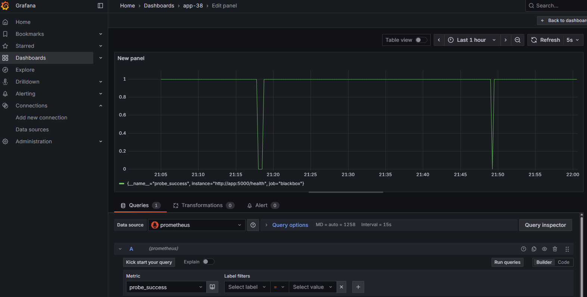

# 📆 Flask Date App with Prometheus & Grafana Monitoring

This project is a simple **Flask web application** running in Docker, displaying the current date and time, with full **monitoring setup** using:

- **Prometheus** for metrics collection  
- **Blackbox Exporter** for HTTP endpoint monitoring  
- **Grafana** for visualization

---

## 🚀 Features

✅ Prints current date and time on access  
✅ `/health` endpoint for health checks  
✅ Logging to stdout/stderr (container logs)  
✅ Docker Compose stack with Prometheus and Grafana  
✅ Blackbox Exporter probes application health

---

## ⚙️ Requirements

- [Docker](https://docs.docker.com/get-docker/)  
- [Docker Compose v2](https://docs.docker.com/compose/)

---

## 💻 Running the Application

Clone this repository and navigate into it:

```bash
git clone <repo-url>
cd <to cloned repo>
docker compose up -d 


## 🔎 Accessing Services

| **Service**    | **URL**                                        | **Default Credentials** |
| -------------- | ---------------------------------------------- | ----------------------- |
| **app-38   **  | [http://localhost:5000](http://localhost:5000) | –                       |
| **Prometheus** | [http://localhost:9090](http://localhost:9090) | –                       |
| **Grafana**    | [http://localhost:3000](http://localhost:3000) | admin / admin           |


## Helth checks on Grafana

